# Latent Performance Benchmarking

> Risk-adjusted portfolio benchmarking with stochastic frontier decomposition, persistence analysis, and diagnostic reporting.

[](https://www.python.org/)
[](LICENSE)
[](tests/)
[](https://docs.scipy.org/doc/scipy/reference/generated/scipy.optimize.minimize.html)

This repository explores how observed portfolio performance can be decomposed into factor exposure, symmetric noise, and one-sided latent performance shortfall. It is designed as a reproducible portfolio analytics workflow for studying ranking stability, persistence, mobility, and model-based performance diagnostics — not as a trading signal or investment recommendation engine.

<p align="center">
  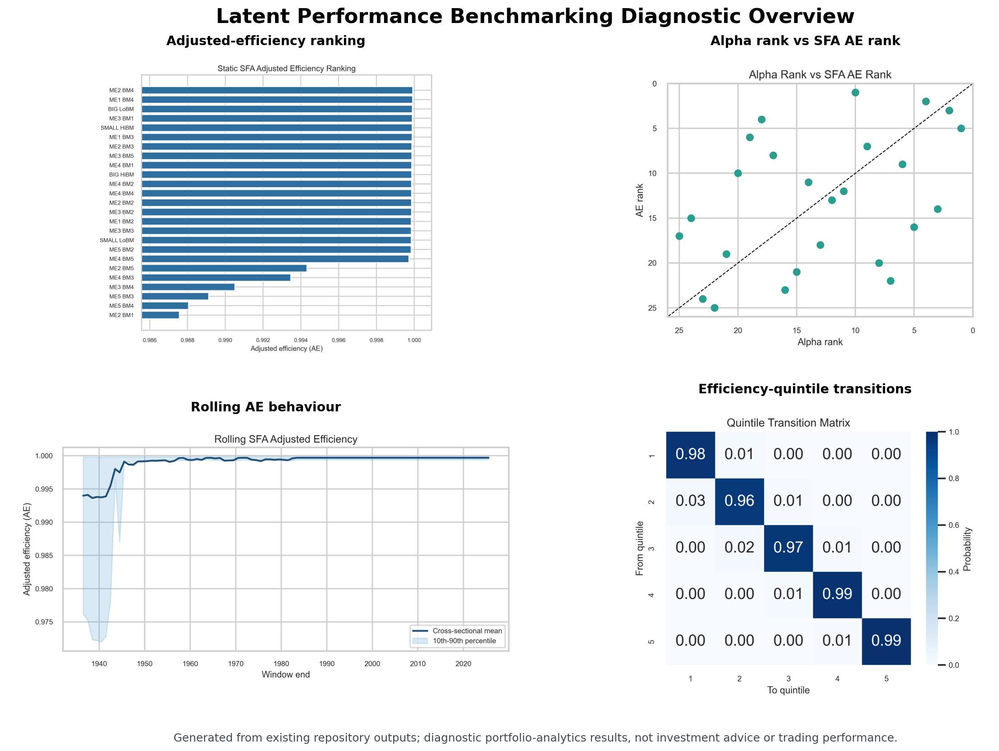
</p>

> Diagnostic overview generated from existing repository outputs: AE rankings, alpha-vs-AE disagreement, rolling adjusted efficiency, and transition behaviour. These are research diagnostics, not investment advice or trading performance.

## At a Glance

| Area | Details |
|---|---|
| Domain | Quantitative finance / portfolio analytics |
| Core problem | Separating observed returns from factor exposure, noise, and persistent latent shortfall |
| Main method | Stochastic frontier analysis with adjusted-efficiency diagnostics |
| Benchmarks | Fama-French-style portfolio and factor data |
| Outputs | AE rankings, alpha comparison, rolling persistence, transition matrices, mobility summaries, residual diagnostics |
| Intended use | Research/portfolio analytics project, not investment advice or a trading system |

## Reviewer Path

For a quick review:

1. Start with the results gallery to inspect the main diagnostics.
2. Open `results/tables/alpha_vs_ae_comparison.csv` to compare conventional alpha ranks against SFA adjusted-efficiency ranks.
3. Open `results/tables/rolling_efficiency_scores.csv` to inspect rolling AE behaviour.
4. Open `results/tables/transition_matrix.csv` and `results/tables/mobility_summary.csv` to assess persistence and movement across efficiency groups.
5. Check `tests/` and `analysis/run_all.py` for reproducibility.

## Why This Project Matters

Raw portfolio returns are difficult to interpret. Outperformance may come from risk exposure, market regime, benchmark choice, noise, or genuine persistent skill. A useful benchmarking workflow should separate these effects as far as the available data allows and make uncertainty visible.

Portfolio monitoring often has to answer questions that noisy realised returns and rolling alpha estimates do not answer cleanly:

- Are apparent performance differences persistent or mostly transitory?
- Are rankings driven by factor exposure, random noise, or repeated shortfall?
- Do portfolios remain in the same relative performance groups through time?
- How different are conventional alpha rankings from SFA adjusted-efficiency rankings?
- How sensitive are results to rolling-window length and frontier assumptions?

By modelling a one-sided latent shortfall, the project adds a diagnostic layer to standard factor benchmarking. This is useful for ranking stability, strategy monitoring, model validation, and research workflows where repeated performance comparisons matter.

## Solution

This project provides a reproducible workflow for:

- comparing portfolio performance against Fama-French-style factor benchmarks;
- estimating risk-adjusted performance metrics and factor-alpha baselines;
- decomposing observed performance into symmetric noise and one-sided latent shortfall;
- analysing rolling rank persistence, transition behaviour, mobility, and window sensitivity;
- producing diagnostic plots, CSV summary tables, and a technical report.

## Methodology Overview

In this repository, latent performance is not treated as hidden trading skill that can be directly observed. It is a model-based diagnostic estimated through stochastic frontier analysis.

The core specification is:

```math
r_{i,t} - r_{f,t} = \alpha_i + \beta_i^T f_t + v_{i,t} - u_i
```

where:

- `r_{i,t} - r_{f,t}` is portfolio excess return;
- `f_t` contains the benchmark risk factors;
- `v_{i,t}` is symmetric statistical noise;
- `u_i >= 0` is a non-negative latent performance shortfall;
- `AE_i = exp(-u_i)` is the adjusted-efficiency diagnostic.

Higher `AE` means lower estimated latent shortfall under the fitted model. It should be read as a diagnostic, not proof of skill or lack of skill.

The implemented SFA layer supports half-normal and truncated-normal specifications. The half-normal model is the default because it is more parsimonious and more stable for rolling-window estimation. The truncated-normal model is retained for static model comparison.

The data layer explicitly selects the first monthly portfolio-return panel from the Fama-French portfolio CSV and excludes annual panels, count panels, average-size panels, blank rows, and footers.

## What This Demonstrates

- Portfolio performance analysis in Python.
- Risk-adjusted benchmarking.
- Latent signal/performance decomposition.
- Time-series diagnostics and persistence analysis.
- Reproducible quantitative research structure.
- Clear communication of assumptions and limitations.

## Workflow

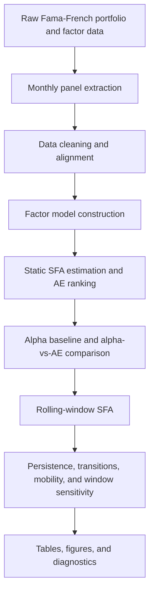

## Repository Structure

| Path | Purpose |
| --- | --- |
| `analysis/` | Alpha baseline, rolling windows, persistence, mobility, robustness, diagnostics, figures, and canonical pipeline |
| `sfa/` | Data loaders and half-normal / truncated-normal stochastic frontier model implementations |
| `data/` | Fama-French factor and 25 size/book-to-market portfolio CSV inputs |
| `results/tables/` | Generated CSV outputs from the reproducible pipeline |
| `results/figures/` | GitHub-readable PNG diagnostics and summary plots |
| `latex_tables/` | Legacy LaTeX tables retained from the earlier report workflow |
| `tests/` | Pytest suite for loaders, SFA models, rolling metrics, and pipeline smoke tests |
| `main_minimal.py` | Compatibility wrapper for `analysis.run_all` |
| `pyproject.toml` | Package metadata and editable install configuration |
| `requirements.txt` | Minimal runtime dependencies |
| `Risk-Adjusted Portfolio Benchmarking via Latent Performance Decomposition.pdf` | Accompanying technical report |

## Quickstart

```powershell
git clone https://github.com/drmshoaib/latent-performance-benchmarking.git
cd latent-performance-benchmarking
python -m venv .venv
.\.venv\Scripts\Activate.ps1
pip install -r requirements.txt
python -m analysis.run_all
```

The canonical command is:

```powershell
python -m analysis.run_all
```

The default pipeline uses FF3 factors, the half-normal SFA model, a 120-month rolling window, and a 12-month rolling step for practical runtime.

For exact 1-, 3-, 6-, and 12-month persistence diagnostics, run with a monthly rolling step:

```powershell
python -m analysis.run_all --rolling-step 1
```

For development checks:

```powershell
pip install -e ".[dev]"
python -m pytest
python -m ruff check .
```

Run a compact local benchmark:

```powershell
python -m analysis.benchmark
```

## Current Outputs

The repository already includes figures and CSV outputs generated by the pipeline. These are diagnostic views for understanding factor-adjusted performance, latent shortfall, persistence, and robustness. They are not evidence of trading profitability.

The current output set is designed to answer four questions:

- How do SFA adjusted-efficiency rankings compare with conventional alpha rankings?
- Are the rankings persistent through time?
- Which portfolios move most across latent-efficiency groups?
- How sensitive are results to rolling-window length and SFA assumptions?

### Static Adjusted-Efficiency Ranking

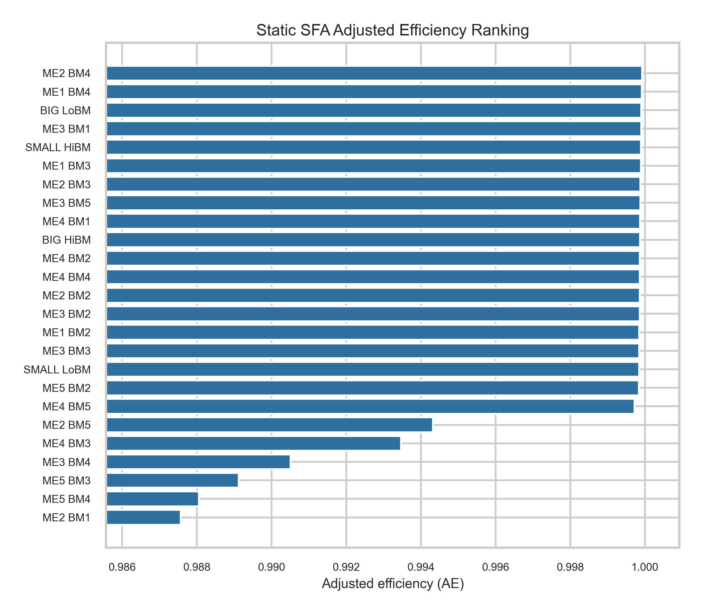

Static adjusted-efficiency ranking from the default half-normal SFA model. Higher `AE` means lower estimated latent shortfall under the fitted model.

### Size and Book-to-Market Heatmap

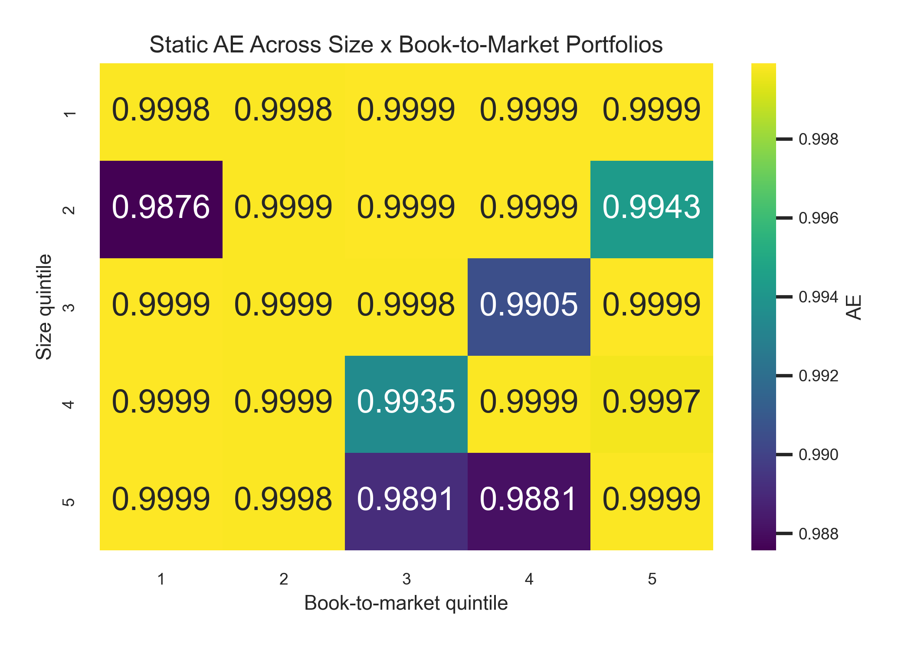

Static AE arranged on the 5x5 size and book-to-market grid. This shows whether the latent shortfall diagnostic has cross-sectional structure across Fama-French portfolio sorts.

### Rolling AE Behaviour

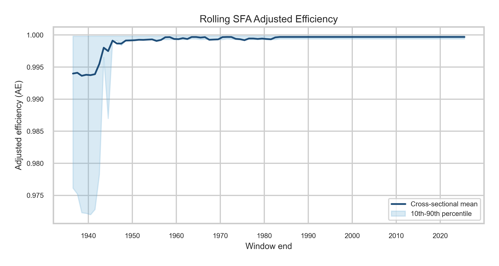

Cross-sectional rolling AE behaviour through time. The line tracks average rolling AE, while the band shows cross-sectional dispersion across portfolios.

### Persistence and Transition Diagnostics

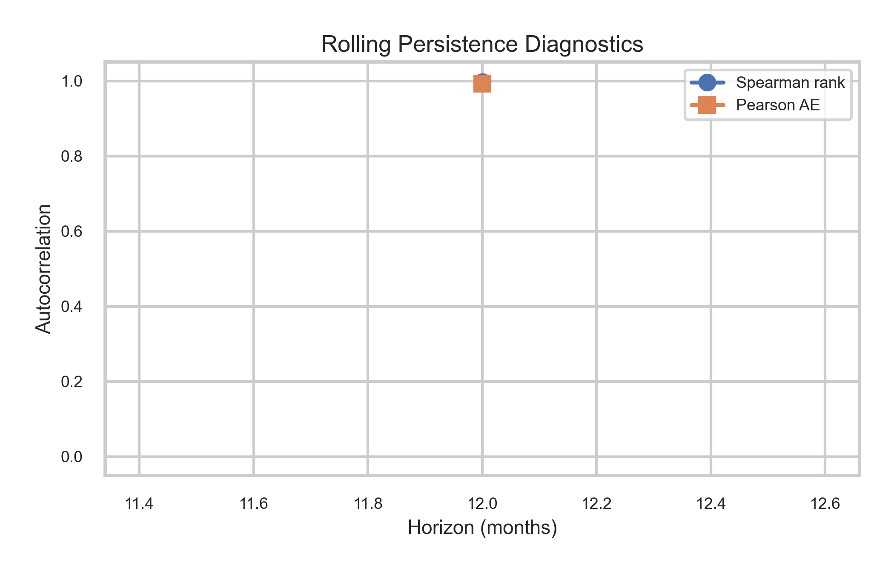

Rolling rank and score persistence by horizon. This helps judge whether SFA rankings are stable or mostly reshuffled across rolling windows.

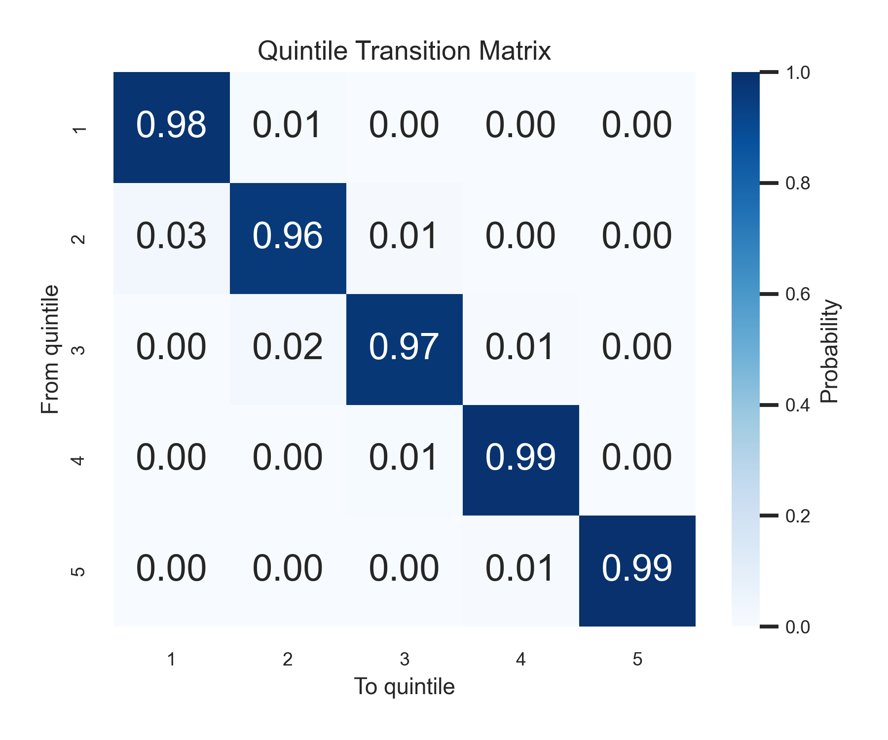

Twelve-month quintile transition probabilities from the rolling SFA output. Diagonal mass indicates persistence; off-diagonal mass indicates movement between latent-efficiency groups.

### Mobility, Alpha Comparison, and Robustness

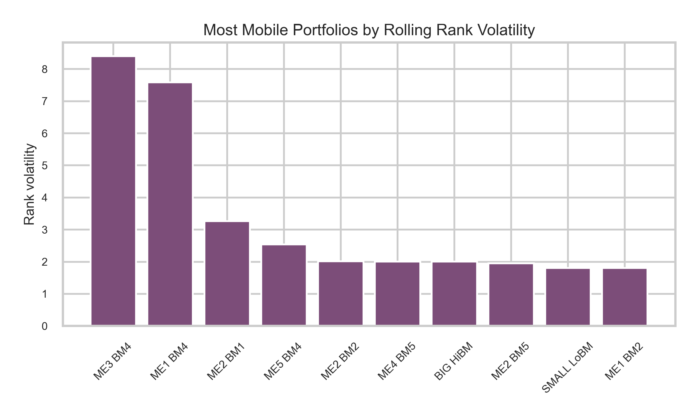

Portfolios with the highest rolling rank volatility. This highlights where relative latent performance is most mobile rather than persistently ranked.

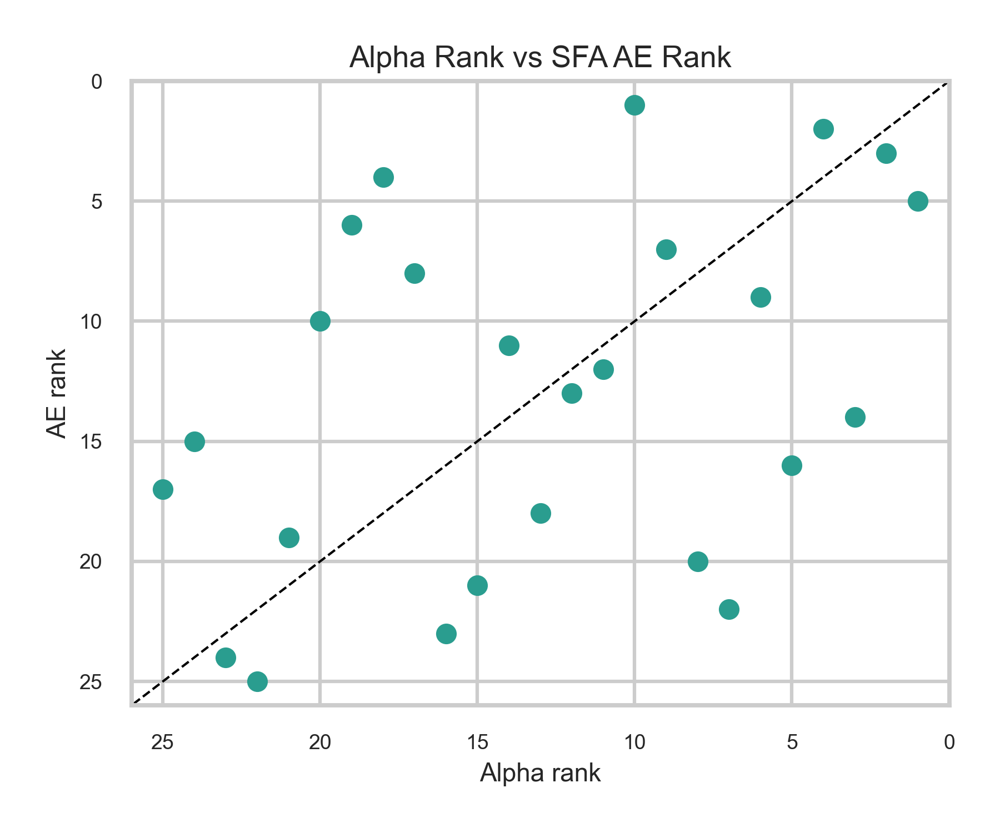

Comparison between conventional factor-alpha ranks and SFA AE ranks. Points far from the diagonal identify portfolios where the two diagnostics disagree most.

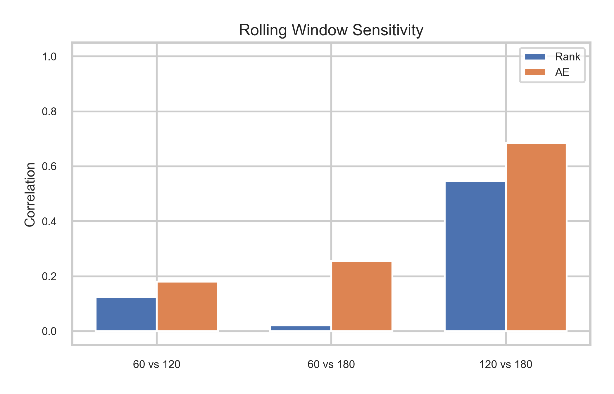

Rolling-window sensitivity across 60-, 120-, and 180-month windows. This checks whether rankings are stable to the window-length choice.

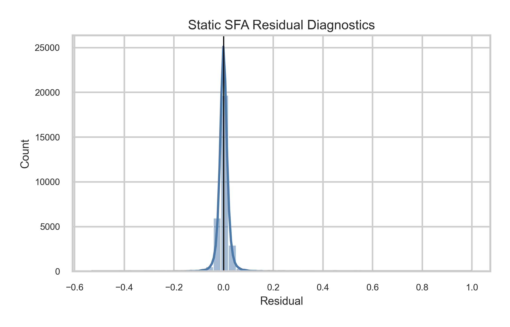

Static SFA residual distribution. This is a quick diagnostic for model fit and residual non-normality, not a formal validation by itself.

## Table Reading Guide

| If you want to inspect... | Start with | What it tells you |
|---|---|---|
| Static frontier rankings | `results/tables/static_efficiency_scores.csv` | AE, `u_hat`, alpha, factor coefficients, likelihood metrics, convergence, and rank by portfolio |
| Observation-level fitted diagnostics | `results/tables/static_efficiency_timeseries.csv` | Fitted frontier values, residuals, composed errors, `u_hat`, and AE by portfolio-date |
| Traditional factor-model benchmark | `results/tables/alpha_baseline.csv` | OLS alpha, alpha t-stat, beta exposures, residual volatility, R-squared, mean excess return, volatility, and Sharpe-like ratio |
| Disagreement between alpha and SFA AE | `results/tables/alpha_vs_ae_comparison.csv` | Alpha rank, AE rank, rank differences, disagreement flags, and Spearman rank correlation |
| Rolling SFA estimates | `results/tables/rolling_efficiency_scores.csv` | Rolling AE, `u_hat`, rank, quintile, convergence status, log-likelihood, AIC, and BIC |
| Rank and score persistence | `results/tables/rank_persistence.csv` | Spearman rank autocorrelation, Pearson AE autocorrelation, rank-change magnitude, and top/bottom quintile stay probabilities |
| Quintile movement | `results/tables/transition_matrix.csv` | Full 5x5 transition probabilities across latent-efficiency quintiles |
| Transition summaries | `results/tables/transition_summary.csv` | Stay, upgrade, downgrade, top-persistence, bottom-persistence, and number of transitions |
| Portfolio-level mobility | `results/tables/mobility_summary.csv` | Mean rank, rank volatility, AE volatility, move-up/down probabilities, and time spent in each quintile |
| Window-length robustness | `results/tables/robustness_summary.csv` | Rank and AE correlations across rolling-window lengths plus top/bottom quintile overlap |
| Distributional SFA sensitivity | `results/tables/model_comparison.csv` | Half-normal versus truncated-normal AE, rank, likelihood, AIC, BIC, and convergence comparison |
| Fit and residual diagnostics | `results/tables/model_diagnostics.csv` | Log-likelihood, AIC/BIC, `sigma_v`, `sigma_u`, lambda, convergence, residual moments, and Jarque-Bera p-values |

For a first review, open the README figures, then inspect `alpha_vs_ae_comparison.csv`, `rolling_efficiency_scores.csv`, `transition_matrix.csv`, and `model_diagnostics.csv`. Together they show the main research story: the comparison against conventional alpha, rolling behaviour, transition structure, and model-fit diagnostics.

## Technical Report

- [Risk-Adjusted Portfolio Benchmarking via Latent Performance Decomposition](Risk-Adjusted%20Portfolio%20Benchmarking%20via%20Latent%20Performance%20Decomposition.pdf)

## Interpretation Notes

The static efficiency score ranks portfolios by estimated benchmark-relative latent shortfall over the full sample. Higher `AE` values indicate lower estimated shortfall under the fitted SFA model.

The alpha baseline provides a conventional factor-model comparison. The `alpha_vs_ae_comparison.csv` output highlights agreement and disagreement between alpha rankings and AE rankings, which is useful for judging whether the frontier diagnostic adds information beyond standard regression alpha.

The rolling efficiency score applies the SFA diagnostic through moving windows. Rank persistence, transition matrices, and mobility summaries measure whether relative efficiency is stable or migrates across quintiles.

Robustness outputs compare rolling-window lengths and static SFA distributional assumptions. They should be read as sensitivity diagnostics rather than definitive model-selection tests.

## Limitations

- This is a research/portfolio analytics implementation, not an investment advice or trading system.
- Latent performance estimates depend on benchmark choice, factor specification, data frequency, rolling-window length, and SFA distributional assumptions.
- Adjusted efficiency is a model-based diagnostic, not direct evidence of skill or lack of skill.
- Persistence analysis describes historical ranking behaviour; it does not prove future outperformance.
- Results should be interpreted as quantitative diagnostics and research outputs, not financial recommendations.

## Portfolio Signal

This repository demonstrates:

- quantitative portfolio analytics;
- risk-adjusted performance measurement;
- stochastic frontier modelling;
- decomposition of noisy financial time series;
- rolling persistence and mobility diagnostics;
- reproducible Python research workflows;
- clear communication of assumptions and limitations.

## Future Extensions

- Add FF5 and momentum data ingestion.
- Add bootstrap confidence intervals for AE and rank differences.
- Implement a pooled panel frontier with explicit portfolio-level inefficiency.
- Compare AE ranking stability against rolling alpha ranking stability.
- Add Bayesian or state-space latent efficiency models.
- Build a dashboard interface for portfolio monitoring.

## Author and Citation

**Dr. Muhammad Shoaib**

GitHub: [drmshoaib](https://github.com/drmshoaib)

If this repository is useful in your research or review process, please cite it using the metadata in `CITATION.cff`.

## License

MIT.
