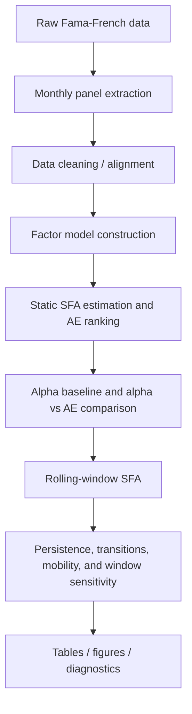

# Latent Performance Benchmarking
## Risk-adjusted portfolio benchmarking using stochastic frontier decomposition

[](https://www.python.org/)
[](LICENSE)
[](tests/)
[](https://docs.scipy.org/doc/scipy/reference/generated/scipy.optimize.minimize.html)

Latent Performance Benchmarking is a quantitative research project for evaluating portfolios with stochastic frontier decomposition. It applies Fama-French-style portfolio and factor data to separate realised risk-adjusted performance into symmetric noise and one-sided latent performance shortfall.

Traditional alpha estimates are useful, but they can be noisy, unstable across rolling windows, and sensitive to factor exposure misspecification. This project adds a model-based adjusted-efficiency diagnostic, then compares that diagnostic against a conventional factor-alpha baseline.

The goal is not to claim that latent efficiency is ground truth. The goal is to provide a reproducible research layer for studying portfolio rankings, factor-adjusted shortfall, rolling stability, transition behaviour, mobility, robustness, and residual diagnostics.

## Why This Project Matters

Portfolio monitoring often has to answer questions that noisy realised returns and rolling alpha estimates do not answer cleanly:

- Are apparent performance differences persistent or mostly transitory?
- Are rankings driven by factor exposure, random noise, or repeated shortfall?
- Do portfolios remain in the same relative performance groups through time?
- How different are conventional alpha rankings from SFA efficiency rankings?
- How sensitive are results to rolling-window length and frontier assumptions?

By modelling a one-sided latent shortfall, the project adds a diagnostic layer to standard factor benchmarking. This is useful for ranking stability, strategy monitoring, model validation, and research workflows where repeated performance comparisons matter.

## Methodology Overview

The core stochastic frontier specification is:

```math
r_{i,t} - r_{f,t} = \alpha_i + \beta_i^T f_t + v_{i,t} - u_i
```

where:

- `r_{i,t} - r_{f,t}` is the portfolio excess return.
- `f_t` contains the benchmark risk factors.
- `v_{i,t}` is symmetric statistical noise.
- `u_i >= 0` is a non-negative latent performance shortfall.
- `AE_i = exp(-u_i)` is the adjusted efficiency score.

The implemented SFA layer supports half-normal and truncated-normal specifications. The half-normal model is the default because it is more parsimonious and more stable for rolling-window estimation. The truncated-normal model is retained for static model comparison.

The data layer explicitly selects the first monthly portfolio-return panel from the Fama-French portfolio CSV and excludes annual panels, count panels, average-size panels, blank rows, and footers.

`AE` should be interpreted as a model-based diagnostic, not proof of skill or lack of skill. The values depend on the factor model, SFA distributional assumptions, data frequency, and portfolio construction.

## Workflow



## Quick Start

From the repository root on Windows:

```powershell
python -m venv .venv
.venv\Scripts\activate
pip install -r requirements.txt
python -m analysis.run_all
```

The canonical command is `python -m analysis.run_all`. The legacy `main_minimal.py` and `analysis/run_*.py` entry points are retained as compatibility wrappers.

The default pipeline uses FF3 factors, the half-normal SFA model, a 120-month rolling window, and a 12-month rolling step for practical runtime. For exact 1-, 3-, 6-, and 12-month persistence diagnostics, run with a monthly rolling step:

```powershell
python -m analysis.run_all --rolling-step 1
```

## Development Setup

Install runtime and development dependencies:

```powershell
python -m venv .venv
.venv\Scripts\activate
pip install -e ".[dev]"
```

Run the test and lint checks:

```powershell
python -m pytest
python -m ruff check .
```

Run a compact local benchmark:

```powershell
python -m analysis.benchmark
```

## Repository Structure

```text
.
|-- data/                         # Input Fama-French-style CSV files
|-- sfa/                          # Factor-data loaders and SFA model classes
|-- analysis/                     # Alpha, rolling, persistence, mobility, diagnostics
|   |-- run_all.py                # Canonical reproducible pipeline
|   `-- benchmark.py              # Compact local runtime benchmark
|-- tests/                        # Synthetic pytest fixtures and contract tests
|-- results/
|   |-- tables/                   # Reproducible CSV outputs from run_all
|   `-- figures/                  # GitHub-readable PNG figures
|-- latex_tables/                 # Legacy LaTeX tables from the first pass
|-- main_minimal.py               # Compatibility wrapper for analysis.run_all
|-- requirements.txt
|-- pyproject.toml
`-- Risk-Adjusted Portfolio Benchmarking via Latent Performance Decomposition.pdf
```

## Current Outputs

### Results Gallery

The generated figures are designed to be readable directly on GitHub. They are not meant to be standalone proof of investment skill; they are visual diagnostics for comparing factor-adjusted performance, persistence, mobility, and model robustness.


*Static adjusted-efficiency ranking from the default half-normal SFA model. Higher AE means lower estimated latent shortfall under the fitted model.*


*Static AE arranged on the 5x5 size and book-to-market grid. This is useful for seeing whether the latent shortfall diagnostic has cross-sectional structure across the Fama-French portfolio sorts.*


*Cross-sectional rolling AE behaviour through time. The line tracks average rolling AE, while the band shows cross-sectional dispersion across portfolios.*


*Rolling rank and score persistence by horizon. This helps users judge whether the SFA ranking is stable or mostly reshuffled across rolling windows.*


*Twelve-month quintile transition probabilities from the rolling SFA output. Diagonal mass indicates persistence; off-diagonal mass indicates movement between latent-efficiency groups.*


*Portfolios with the highest rolling rank volatility. This highlights where relative latent performance is most mobile rather than persistently ranked.*


*Comparison between conventional factor-alpha ranks and SFA AE ranks. Points far from the diagonal identify portfolios where the two diagnostics disagree most.*


*Rolling-window sensitivity across 60-, 120-, and 180-month windows. This is a robustness check on whether the ranking is stable to the window-length choice.*


*Static SFA residual distribution. This is a quick diagnostic for model fit and residual non-normality, not a formal validation by itself.*

### Table Reading Guide

| If you want to inspect... | Start with | What it tells you |
| --- | --- | --- |
| Static frontier rankings | [static_efficiency_scores.csv](results/tables/static_efficiency_scores.csv) | AE, `u_hat`, alpha, factor coefficients, likelihood metrics, convergence, and rank by portfolio. |
| Observation-level fitted diagnostics | [static_efficiency_timeseries.csv](results/tables/static_efficiency_timeseries.csv) | Fitted frontier values, residuals, composed errors, `u_hat`, and AE by portfolio-date. |
| Traditional factor-model benchmark | [alpha_baseline.csv](results/tables/alpha_baseline.csv) | OLS alpha, alpha t-stat, beta exposures, residual volatility, R-squared, mean excess return, volatility, and Sharpe-like ratio. |
| Disagreement between alpha and SFA AE | [alpha_vs_ae_comparison.csv](results/tables/alpha_vs_ae_comparison.csv) | Alpha rank, AE rank, rank differences, disagreement flags, and Spearman rank correlation. |
| Rolling SFA estimates | [rolling_efficiency_scores.csv](results/tables/rolling_efficiency_scores.csv) | Rolling AE, `u_hat`, rank, quintile, convergence status, log-likelihood, AIC, and BIC. |
| Rank and score persistence | [rank_persistence.csv](results/tables/rank_persistence.csv) | Spearman rank autocorrelation, Pearson AE autocorrelation, rank-change magnitude, and top/bottom quintile stay probabilities. |
| Quintile movement | [transition_matrix.csv](results/tables/transition_matrix.csv) | Full 5x5 transition probabilities across latent-efficiency quintiles. |
| Transition summaries | [transition_summary.csv](results/tables/transition_summary.csv) | Stay, upgrade, downgrade, top-persistence, bottom-persistence, and number of transitions. |
| Portfolio-level mobility | [mobility_summary.csv](results/tables/mobility_summary.csv) | Mean rank, rank volatility, AE volatility, move-up/down probabilities, and time spent in each quintile. |
| Window-length robustness | [robustness_summary.csv](results/tables/robustness_summary.csv) | Rank and AE correlations across rolling-window lengths plus top/bottom quintile overlap. |
| Distributional SFA sensitivity | [model_comparison.csv](results/tables/model_comparison.csv) | Half-normal versus truncated-normal AE, rank, likelihood, AIC, BIC, and convergence comparison. |
| Fit and residual diagnostics | [model_diagnostics.csv](results/tables/model_diagnostics.csv) | Log-likelihood, AIC/BIC, `sigma_v`, `sigma_u`, lambda, convergence, residual moments, and Jarque-Bera p-values. |

For a first review, open the README figures, then inspect `alpha_vs_ae_comparison.csv`, `rolling_efficiency_scores.csv`, `transition_matrix.csv`, and `model_diagnostics.csv`. Together they show the main research story, the comparison against conventional alpha, the rolling behaviour, and the model-fit diagnostics.

### Technical Report

- [Risk-Adjusted Portfolio Benchmarking via Latent Performance Decomposition](Risk-Adjusted%20Portfolio%20Benchmarking%20via%20Latent%20Performance%20Decomposition.pdf)

## Key Interpretation

The static efficiency score ranks portfolios by estimated benchmark-relative latent shortfall over the full sample. Higher `AE` values indicate lower estimated shortfall under the fitted SFA model.

The alpha baseline provides a conventional factor-model comparison. The `alpha_vs_ae_comparison.csv` output highlights agreement and disagreement between alpha rankings and AE rankings, which is useful for judging whether the frontier diagnostic adds information beyond standard regression alpha.

The rolling efficiency score applies the SFA diagnostic through moving windows. Rank persistence, transition matrices, and mobility summaries measure whether relative efficiency is stable or migrates across quintiles.

Robustness outputs compare rolling-window lengths and static SFA distributional assumptions. They should be read as sensitivity diagnostics rather than definitive model-selection tests.

## Limitations

- SFA distributional assumptions matter.
- Factor model misspecification can affect efficiency scores.
- Latent shortfall is not direct proof of skill or lack of skill.
- The half-normal model can estimate very small `sigma_u` for some portfolios, making AE close to one.
- Rolling results depend on window length, step size, and convergence filtering.
- Results are research diagnostics, not investment advice.

## Future Extensions

- Add FF5 and momentum data ingestion.
- Add bootstrap confidence intervals for AE and rank differences.
- Implement a pooled panel frontier with explicit portfolio-level inefficiency.
- Compare AE ranking stability against rolling alpha ranking stability.
- Add Bayesian or state-space latent efficiency models.
- Build a dashboard interface for portfolio monitoring.

## Professional Relevance

This repository demonstrates:

- Quant research framing and empirical diagnostics.
- Asset management analytics and portfolio monitoring.
- Model validation around factor-adjusted performance.
- Reproducible quantitative Python workflows.
- Clear communication of model-based investment research.

## Author and Citation

**Dr. Muhammad Shoaib**  
GitHub: [drmshoaib](https://github.com/drmshoaib)

If this repository is useful in your research or review process, please cite it using the metadata in `CITATION.cff`.
